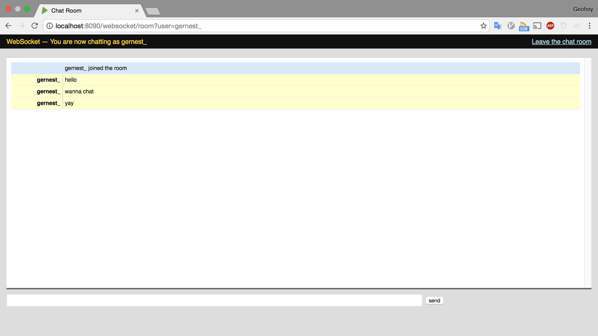

# chat
Simple chat application with utron

This is implementation of a chat application that ports [revel based chat
application](https://revel.github.io/samples/chat.html) to use utron framework.

# Prerequisite

You only need a working Go environment

# Installation
```
go get github.com/utronframework/chat
```

# Running the application

```
 cd $GOPATH/github.com/utronframework/chat
 go run main.go
```

# screen shot

